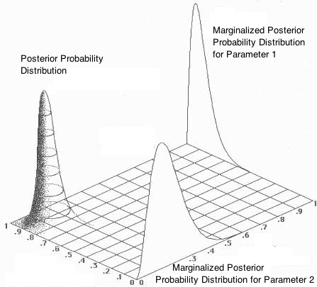

# Parameter Estimation by Bayesian Fitting

Most recent version by Sheila Kannappan June 2017, with major contributions from Kathleen Eckert and Rohan Isaac.

Note that in this tutorial when we refer to multiple models, we mean models with different parameter values within the same model class (e.g. straight lines). For now we will not discuss the topic of comparing whole _model families_ such as straight lines and second-order fits, but it follows naturally from the present discussion.

This tutorial is a sequel to [Parameter Estimation by Maximum Likelihood Fitting](https://github.com/capprogram/2017bootcamp-general/blob/master/frequentist_paramfitting_tutorial.md), which detailed the frequentist approach to fitting a line. In the frequentist approach we determined the *_likelihood of the data given the model_* P(D|M), meaning we considered one model and many data sets. The initial fake data set was imagined to be an example data set drawn from many possible experiments, which we could mathematically model under the assumption that the other experiments would provide data points distributed in Gaussian fashion around the measured data points (i.e., the standard sleight of hand of statistics, substituting the observed data distribution for "true" parent distribution). Thus it made sense to seek a single "best fit" model with maximum likelihood estimate (MLE) parameters.

By contrast, in the Bayesian framework we do not imagine many possible experiments that have not actually been conducted. Instead, we determine the *_likelihood of the model given the data_* P(M|D), meaning we consider many models and only one data set. The Bayesian approach to parameter estimation replaces "point estimates" such as the "best fit" MLE parameters with full probability distributions describing the likelihood of different parameter values being correct, given not only new data but also prior knowledge. In practice, P(M|D) is derived using Bayes theorem.

#### Bayes's Theorem

Bayes theorem is a purely mathematical statement accepted as true by both frequentists and Bayesians, which relates four different probability distributions.

1. P(D|M) - the likelihood or “probability of the data given the model”
2. P(M) - the model prior, representing prior knowledge about the likelihood of different parameter values
3. P(D) - the probability of the data (the probability of the data independent of the model may be tough to define but generally divides out of any calculation of interest)
4. P(M|D) - the posterior or "probability of the model given the data"

A frequentist implicitly assumes that P(M) is "flat" (all parameters are equally likely) and maximizes P(D|M) to find the single "best" set of parameters, so P(M|D) is just proportional to P(D|M) and is not retained. A Bayesian may sometimes assume P(M) is flat (an "uninformative" prior such as this is preferred in the absence of other constraints), but regardless will keep the full posterior probability distribution P(M|D) to describe the parameter values. If only one parameter is of interest (for example, the slope of the line), the Bayesian will typically "marginalize" (numerically integrate) over dimensions of the probability distribution corresponding to uninteresting parameters (in this example the intercept), reducing the multivariate P(M|D) to a 1D probability distribution for the  parameter of interest. At that point, a point estimate (median, mean) and/or confidence intervals (68%, 95%) may be derived to summarize the marginalized posterior distribution.

To gain a concrete understanding of the Bayesian approach we will perform a "brute force" Bayesian computation to fit a line. We will generate a grid of models spanning the slope and intercept ranges we consider plausible, meaning P(M) is zero outside these ranges. We will compute the likelihood P(D|M) for each model in the grid and multiply each likelihood by the prior for that model to get the posterior P(M|D), up to the unknown normalization P(D). In practice these steps are array operations performed simultaneously over the entire model grid. Finally, we will add all the P(M|D) values and divide by the total so that the total probability contained in the grid adds to one. This normalization step is valid if we are only interested in relative probabilities and can ignore P(D).

Download the code [paramfit2.py](https://github.com/capprogram/2017bootcamp-general/blob/master/paramfit2.py), which uses the same fake data set we used in [paramfit1.py](https://github.com/capprogram/2017bootcamp-general/blob/master/paramfit1.py) for frequentist parameter estimation. This time, however, we will determine the slope and intercept through Bayesian analysis by constructing a grid of possible values of the slope and intercept and evaluating the posterior probability at each grid point. Fill in any lines of code ending in "?".

1) Run `paramfit2.py` and plot the fake data. The code has preset grids for the intercept and slope values. What values are being considered? What are the implicit priors on the slope and intercept?

2) Check that the models in the grid are uniformly distributed. To do this plot a series of lines using all possible intercepts (`y=x+beta_i`) and then all possible slopes (`y=x*alpha_i`). Does the model space evenly sample intercept values? What about slope values? Note that "uniform priors" can be uniform in either the parameter or in a function of the parameter depending on what physically makes sense, e.g. a uniform prior in log(x) is called a "scale-free" prior because all orders of magnitude in x are equally probably. More generally, priors that attempt to avoid biasing the result are called "uninformative". Considering the visual appearance of the linearly evenly spaced slope values, might there be another physically motivated definition of "evenly spaced" for the slope, resulting in another choice of "uninformative" prior? 

3) Read through the first part of [Jake VanderPlas's Tutorial on Bayesian MCMC Line Fitting](http://jakevdp.github.io/blog/2014/06/14/frequentism-and-bayesianism-4-bayesian-in-python/) from "Test Problem: Line of Best Fit" through "Prior on Slope and Intercept", stopping at "Prior on &sigma;". How can we write a prior that compensates for the non-uniform spacing of our grid in the angle of the line?
**Note that in the article the definition of alpha and beta are reversed to be y = α + βx. ** Fill in the code to compute priors on the slope and intercept in the flat and "compensating" cases. (Here we do not need to normalize the prior distributions to sum to 1 because we will consider only relative, not absolute probabilities.)

4) Using the fake data, compute the posterior probability distributions (posterior distributions for short) for the entire grid assuming 1) flat priors on the values of the slopes and intercepts (non-uniform in the angle) and 2) the "compensating" prior that is uniform in the angle. Pay attention to where the overall model prior (the product of the individual priors on the model parameters) appears in the equation for computing the posterior probabilities.

5) Now that we have computed the posterior distribution over the entire parameter space, we can find the marginalized posterior distributions for individual parameters by summing over the posterior distributions of the other parameters (i.e., if we want to look at the posterior distribution of the slope, we sum over the posterior distribution of the intercept). A common pitfall of marginalization is thinking that parameters can be marginalized separately, then combined. In fact point estimates (means, medians, peak locations, etc.) derived from the marginalized distributions do not "go together", i.e. the "maximum marginalized posterior" estimates of the slope and intercept are not the same values that define the maximum of the joint, unmarginalized probability distribution. (See diagram.)
    
Plot the marginalized posterior distributions of the slope using the two different priors (green for flat and red for compensating). Are there any differences (you may need to zoom in)? How do the marginalized posterior distributions of the slope compare with the MLE values from paramfit1.py? Estimate the uncertainty on the slope value from the plot by eye (you may need to zoom in on the region of significant probability). How does the uncertainty on the slope compare with the MLE uncertainty value? Do the same for the intercept. What happens to the marginalized posterior distributions for the slope and intercept if you change the number of data points (try N=100, N=10) or the size of the errors (try bigger and smaller)? What happens if you change the grid spacing (try slope ranges from 1-10 in steps of 0.1, intercept ranges from 1-10 in steps of 1)?

Some answers to the above questions are provided [here](https://github.com/capprogram/2017bootcamp-general/blob/master/paramfit2_soln.py).

In Bayesian analysis, it is important to think about the question you are trying to answer when setting up the problem. Starting with a well understood model grid and set of priors is key. In this case do you want a flat prior on the slope and intercept, or do you want a prior that compensates for the unequal distribution in angles? Over what range, and how finely should you bin the grids? When there is no obvious right answer, Bayesians test the sensitivity of their results to different assumptions and report the variation observed. As a rule of thumb, the choice of prior won't matter much for high-quality data, but may matter a lot when there are few data points or large error bars.

Most Bayesian computational modeling is too demanding to do by "brute force" as we have, so approximate methods have been developed using Markov Chain Monte Carlo (MCMC) sampling. Take a look at the rest of [Jake VanderPlas's Tutorial on Bayesian MCMC Line Fitting](http://jakevdp.github.io/blog/2014/06/14/frequentism-and-bayesianism-4-bayesian-in-python/) to see how to fit a line under three popular python MCMC packages. (You already have one, `pymc`, installed under Anaconda.) For more information on the Bayesian approach, check out the remaining tutorials linked [here](http://jakevdp.github.io/blog/2014/03/11/frequentism-and-bayesianism-a-practical-intro/).
