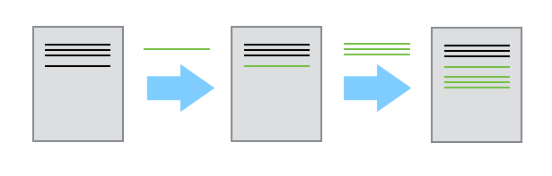
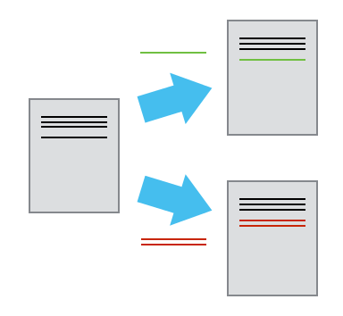
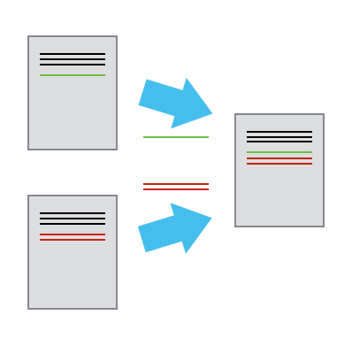

|[Table of Contents](00-contents.md) | [2. Creating a repository ➡](02-creating-a-repository.md) |
|:----:| ----:|

# 1. Automated Version Control

We'll start by exploring how version control can be used
to keep track of what one person did and when.
Even if you aren't collaborating with other people,
automated version control is much better than this situation:

"Piled Higher and Deeper" by Jorge Cham, http://www.phdcomics.com

We've all been in this situation before: it seems ridiculous to have
multiple nearly-identical versions of the same document. Some word
processors let us deal with this a little better, such as Microsoft
Word's "Track Changes" or Google Docs' [version
history](https://support.google.com/docs/answer/190843?hl=en).

Most version control systems start with a base version of the document and
then save just the changes you made at each step of the way. 

Once you think of changes as separate from the document itself, you
can then think about applying different sets of changes onto the
base document and getting different versions of the document. For
example, two users can make independent sets of changes based on the
same document in different development "branches".

If there aren't conflicts, you can "merge" the two "branches" into the same final document.

A version control system is a tool that keeps track of these changes for us and
helps us version and merge our files. It allows you to
decide which changes make up the next version, called a
**commit**, and keeps useful metadata about them. The
complete history of commits for a particular project and their metadata make up
a **repository**. Repositories can be kept in sync
across different computers facilitating collaboration among different people.

## The Long History of Version Control Systems

Automated version control systems are nothing new.
Tools like RCS, CVS, or Subversion have been around since the early 1980s and are used by many large companies.
However, many of these are now becoming considered as legacy systems due to various limitations in their capabilities.
In particular, the more modern systems, such as Git and [Mercurial](http://swcarpentry.github.io/hg-novice/)
are *distributed*, meaning that they do not need a centralized server to host the repository.
These modern systems also include powerful branching and merging tools that make it possible for multiple authors to work within
the same files concurrently.

Adapting text from the [ProGit book](https://git-scm.com/book/en/v2) (an in-depth, free reference manual for git):

"Some people refer to Git’s branching model as its 'killer feature,' and it certainly sets Git apart in the version control community." Unlike other version control systems, Git doesn't actually save changes, but rather full snapshots at each commit step, although it saves disk space by substituting storage pointers for any unchanged files. "When you make a commit, Git stores a commit object that contains a pointer to the snapshot of the content... If you make some changes and commit again, the next commit stores a pointer to the commit that came immediately before it... A branch in Git is simply a lightweight movable pointer to one of these commits. The default branch name in Git is 'master'. As you start making commits, you’re given a master branch that points to the last commit you made. Every time you commit, it moves forward automatically... What happens if you create a new branch? Doing so creates a new pointer for you to move around." 

If you create a branch called 'testing' to develop a new feature in your code and switch to the testing branch (in Git-speak, "check it out"), then new commits will move the testing pointer forward instead of the master pointer. Meanwhile you might learn you need to make an urgent change in the master branch -- no problem, you can just take a break from working on 'testing' to check out the master branch and make the urgent change, then commit it and go back to working on the testing branch. Collaborators can work on different branches in the same code development project. After a while each branch contains commits that aren't in the other branches. Git's "merge" command will combine branches into master intelligently, checking for incompatibilities and asking you to fix them.  

## Paper Writing
*   Imagine you drafted an excellent paragraph for a paper you are writing, but later ruin it. How would you retrieve
    the *excellent* version of your conclusion? Is it even possible?
*   Imagine you have 5 co-authors. How would you manage the changes and comments they make to your paper?
    If you use LibreOffice Writer or Microsoft Word, what happens if you accept changes made using the
    `Track Changes` option? Do you have a history of those changes?
*   Git can store binary files, but it is most powerful when used for text (ASCII) files such as code or markup language, 
    because it can detect and describe changes between versions for text files. Thus for paper writing, Git is very
    powerful in combination with LaTeX.
